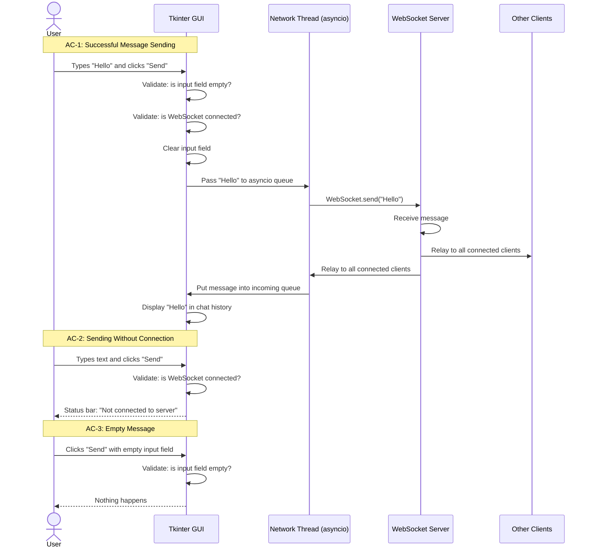

# Architecture: Message Sending Flow

## Sequence Diagram

## Description
The diagram visualizes three acceptance criteria from `feature_send_message.md`:
1. **AC-1 (Success):** The full message path — user input → GUI validation → asyncio network thread → WebSocket → server relay → back to all clients' chat history.
2. **AC-2 (No Connection):** GUI checks WebSocket state and displays an error in the status bar if not connected.
3. **AC-3 (Empty Input):** GUI rejects an empty message before any network call occurs.