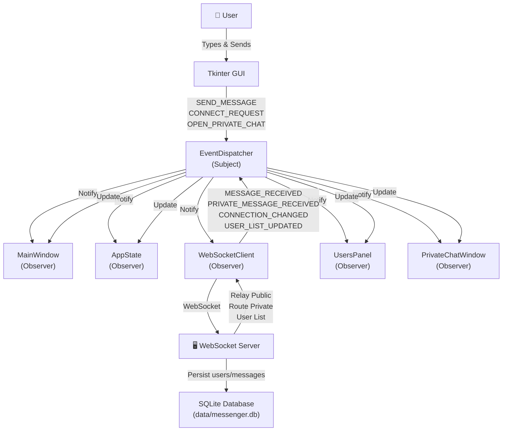
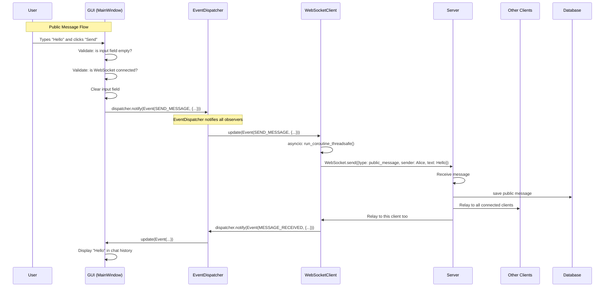
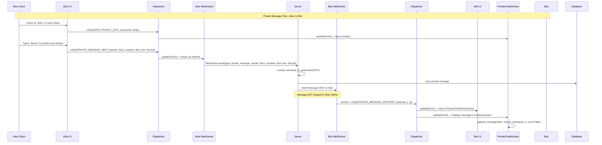
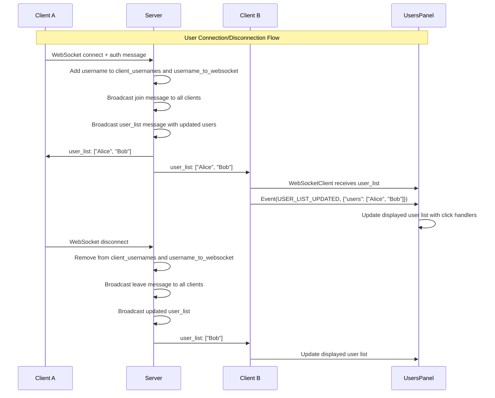

# Architecture: Message Sending Flow & Private Direct Messages

## System Architecture Diagram



## Public Message Sending Sequence



## Private Message Sending & Receiving Sequence



## User List Update Flow



## Event Flow Description

### Public Message (Existing)
1. **User Input**: User types and clicks Send in MainWindow
2. **UI Validation**: GUI validates input and connection state
3. **Event Creation**: GUI creates `Event(SEND_MESSAGE, {text, username})`
4. **Dispatcher Notification**: `dispatcher.notify(event)` called
5. **Routing**: All observers notified (Network, State, UI)
6. **Network Processing**: WebSocketClient formats and sends structured `{type: public_message, sender, text}`
7. **Server Broadcast**: Message relayed to all connected clients
8. **Message Received**: WebSocketClient fires `Event(MESSAGE_RECEIVED, {message})`
9. **UI Display**: MainWindow receives message event and updates chat history

### Private Message (New)
1. **User Selection**: User clicks on username in UsersPanel
2. **Dispatcher Event**: UsersPanel emits `Event(OPEN_PRIVATE_CHAT, {username})`
3. **Window Mgmt**: MainWindow.private_chat_manager.open_chat() creates/focuses window
4. **Private Window**: PrivateChatWindow opens independently with peer username
5. **User Sends**: User types message and clicks Send in PrivateChatWindow
6. **Dispatcher Event**: PrivateChatWindow emits `Event(PRIVATE_MESSAGE_SENT, {sender, recipient, text})`
7. **Controller Processing**: Controller validates and formats structured payload
8. **Network Send**: WebSocketClient sends `{type: private_message, sender, recipient, text}` to server
9. **Server Routing**: Server looks up recipient in `username_to_websocket` and sends ONLY to that connection
10. **Recipient Receive**: WebSocketClient fires `Event(PRIVATE_MESSAGE_RECEIVED, {payload})`
11. **Auto-Window Open**: MainWindow opens PrivateChatWindow if not already open
12. **Display**: PrivateChatWindow receives event and displays message with sender name

## Key Improvements Over Queue-Based System

| Aspect | Old (Queues) | New (Observer Pattern) |
|--------|-------------|----------------------|
| Coupling | High (direct queue refs) | Low (event-based) |
| Scalability | Limited (4 fixed queues) | High (add observers dynamically) |
| Private Messaging | Not supported | Fully supported with window mgmt |
| Thread Safety | Manual queue thread-safety | Built-in dispatcher locks |
| Debugging | Multiple queues to trace | Single dispatcher logs events |
| Extensibility | Requires new queues | Just add new Observer |
| Code Clarity | Queue management scattered | Clear event types and handlers |

## Message Model: Structured vs Raw Text

**Old Format** (Legacy):
```
"[13:45:21] Alice: Hello World"
```

**New Format** (Structured JSON):
```json
{
  "type": "public_message|private_message",
  "sender": "Alice",
  "recipient": "Bob",  // empty for public messages
  "text": "Hello World",
  "timestamp": "2026-05-31T13:45:21.123456"
}
```

Advantages:
- **Type distinction**: Server can route private messages to single recipient
- **Metadata extraction**: Recipient name parsed reliably from payload
- **Forward compatibility**: New fields can be added without breaking parsing
- **Server-side routing**: Server decision logic based on message type, not heuristics

## Server Username Mapping

```python
client_usernames: dict[WebSocket, str]
    # Maps: WebSocket object -> Username string
    # Use: Track username for disconnection cleanup

username_to_websocket: dict[str, WebSocket]
    # Maps: Username string -> WebSocket object
    # Use: Lookup socket when routing private messages
```

Both kept in sync on authentication and disconnection.

## Private Chat Window Manager

```python
class PrivateChatWindowManager:
    windows: dict[str, PrivateChatWindow]
        # Key: peer username
        # Value: PrivateChatWindow instance
    
    def open_chat(username) -> PrivateChatWindow:
        # If window exists: focus existing window (no duplicate)
        # If window doesn't exist: create new window and store
```

## Event Types Reference

See [core/events/README.md](../../core/events/README.md) for complete event type documentation.

New events added:
- `OPEN_PRIVATE_CHAT`: User selected from UsersPanel
- `PRIVATE_CHAT_OPENED`: Window manager opened private chat
- `PRIVATE_MESSAGE_SENT`: User sent private message
- `PRIVATE_MESSAGE_RECEIVED`: Server routed private message to client
