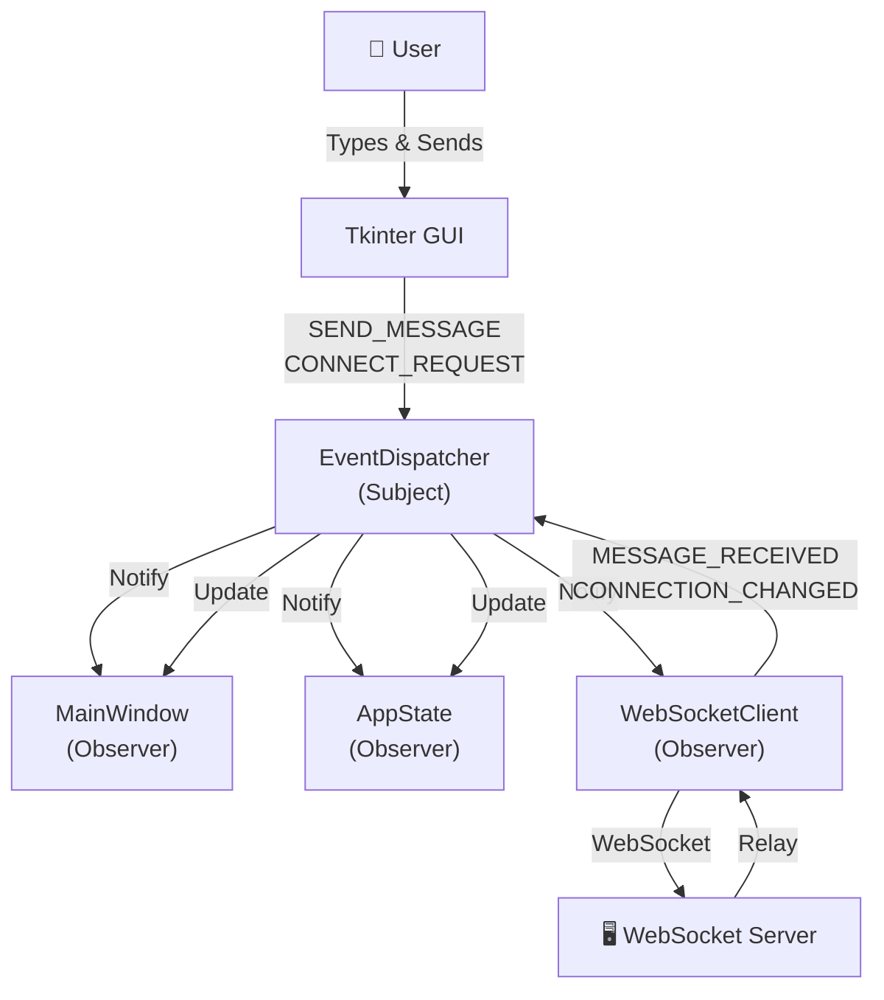
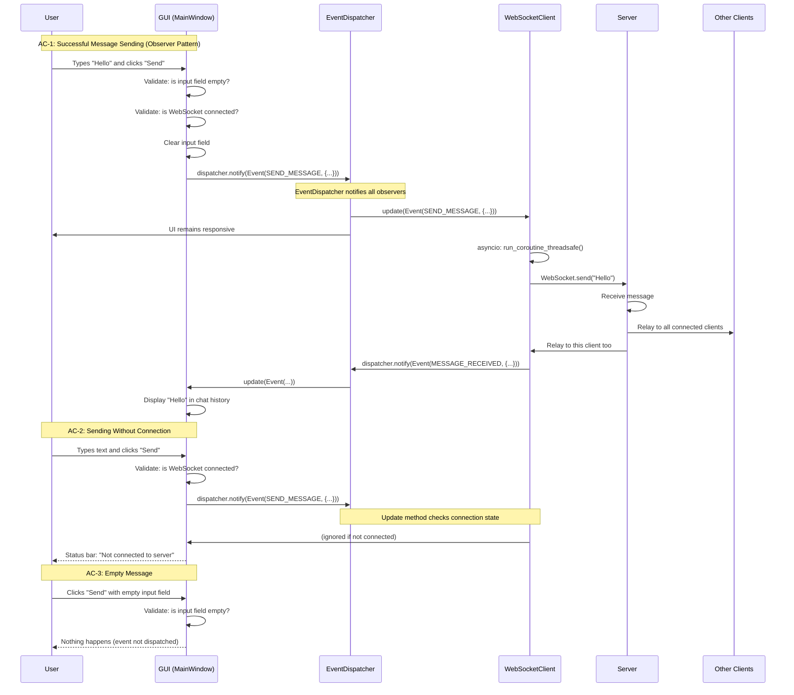

# Architecture: Message Sending Flow

## System Architecture Diagram

## Sequence Diagram

## Event Flow Description

The diagram visualizes the Observer pattern implementation with three acceptance criteria:

### AC-1 (Success): Full Message Path with Event Dispatcher
1. **User Input**: User types "Hello" and clicks Send
2. **UI Validation**: GUI validates input and connection state
3. **Event Creation**: GUI creates `Event(SEND_MESSAGE, {...})`
4. **Dispatcher Notification**: `dispatcher.notify(event)` called
5. **Observer Updates**: All attached observers (Network, State, UI) receive `update(event)` calls
6. **Network Processing**: WebSocketClient processes SEND_MESSAGE event asynchronously
7. **Server Relay**: Message sent via WebSocket to server
8. **Server Broadcast**: Server relays to all connected clients
9. **Message Received**: WebSocketClient fires `Event(MESSAGE_RECEIVED, {...})`
10. **UI Display**: GUI receives message event and updates chat history

### AC-2 (No Connection): Event Dispatch Without Active Connection
- GUI validates connection before sending event
- Alternatively, Network observer ignores SEND_MESSAGE if not connected
- Error event dispatched via dispatcher to inform user

### AC-3 (Empty Input): Event Not Dispatched for Invalid Input
- GUI validates input (non-empty) before creating event
- No event is dispatched if validation fails
- No processing overhead on network or state layers

## Key Improvements Over Queue-Based System

| Aspect | Old (Queues) | New (Observer Pattern) |
|--------|-------------|----------------------|
| Coupling | High (direct queue refs) | Low (event-based) |
| Scalability | Limited (4 fixed queues) | High (add observers dynamically) |
| Thread Safety | Manual queue thread-safety | Built-in dispatcher locks |
| Debugging | Multiple queues to trace | Single dispatcher logs events |
| Extensibility | Requires new queues | Just add new Observer |
| Code Clarity | Queue management scattered | Clear event types and handlers |

## Event Types Reference

See [core/events/README.md](../../core/events/README.md) for complete event type documentation.
